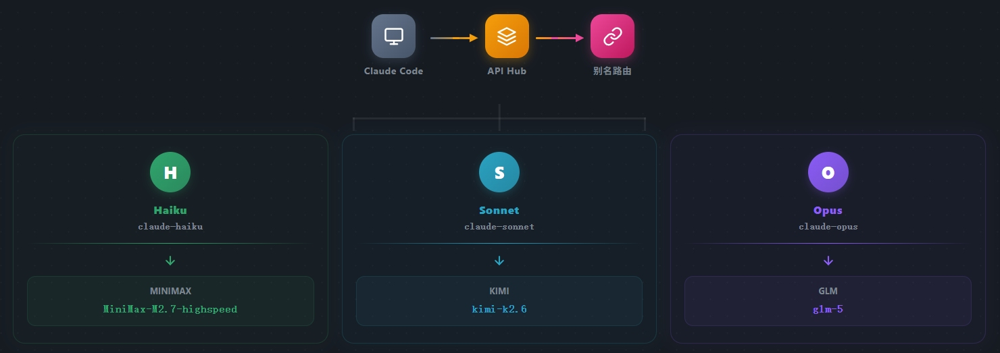
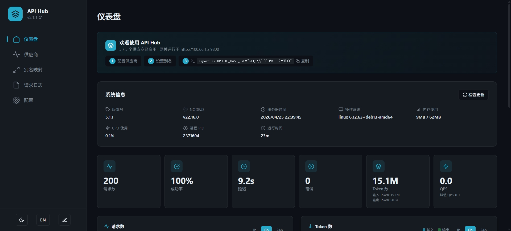
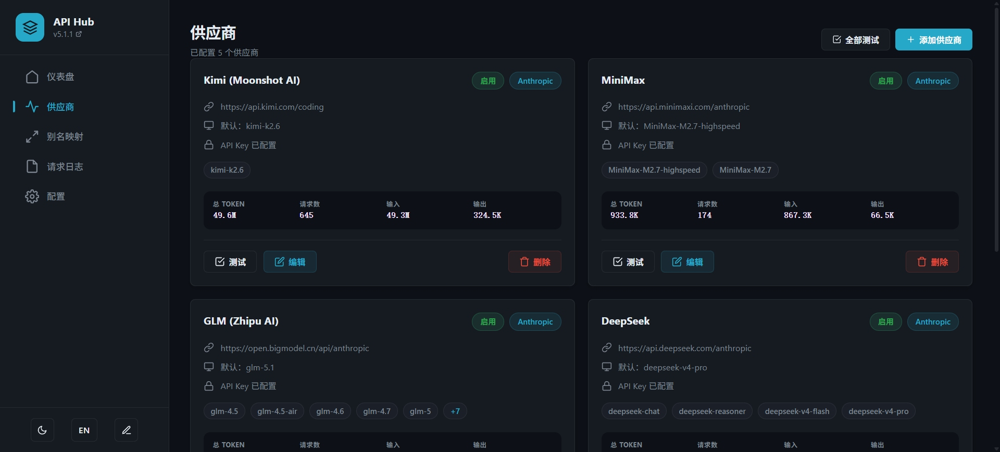
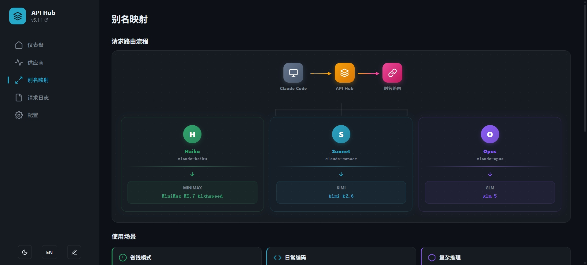
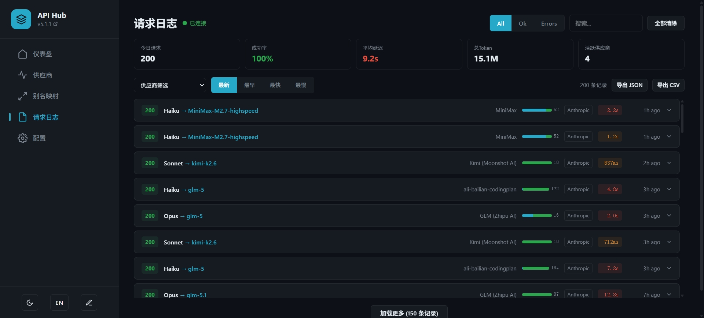
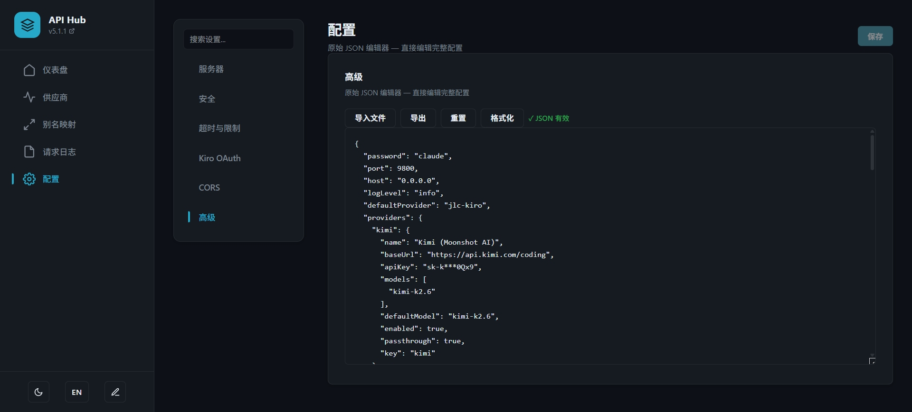

<div align="center">

# Claude API Hub

**一个网关，将 Claude Code 路由到任意 LLM 供应商**

[](https://www.npmjs.com/package/claude-api-hub)
[](LICENSE)
[](package.json)
[](./coverage/)
[](https://github.com/LeenixP/claude-api-hub/actions/workflows/ci.yml)

[中文](README.md) | [English](README.en.md)

</div>

<div align="center">
  
</div>

一个本地 API 网关，通过模型别名（haiku / sonnet / opus）让 Claude Code 将请求路由到任意 LLM 供应商。通过 Web 仪表盘管理一切 —— 无需配置文件。

## 最新动态

查看 [CHANGELOG.md](CHANGELOG.md) 了解最新更新。

## 为什么选择 Claude API Hub？

- **在 Claude Code 中使用任意 LLM** —— 将 Sonnet 请求路由到 Kimi、GLM、MiniMax、DeepSeek 或任何兼容 OpenAI 的 API
- **零配置切换** —— 从 Web 仪表盘更改模型路由，无需重启
- **零运行时依赖** —— 基于 Node.js 原生 `http` 模块构建，安装体积约 50KB

---

## 30 秒快速开始

```bash
# 1. 安装（或直接用 npx 运行）
npm install -g claude-api-hub

# 2. 启动网关
claude-api-hub
# ✓ api-hub listening on http://0.0.0.0:9800

# 3. 配置 Claude Code
echo '{"env":{"ANTHROPIC_BASE_URL":"http://127.0.0.1:9800"}}' > ~/.claude/settings.json

# 4. 完成！Claude Code 现在通过网关路由请求
```

> **安全提示：** 默认绑定 `0.0.0.0:9800` 且无密码。生产环境请设置 `password`。

---

## 架构

```
┌─────────────────────────────────────────────────────────────────────┐
│                        Claude API Hub                               │
├─────────────────────────────────────────────────────────────────────┤
│                                                                     │
│  ┌──────────────┐    ┌──────────────┐    ┌──────────────────────┐ │
│  │   Dashboard  │    │  API Router  │    │   Protocol Bridge   │ │
│  │  (Web UI)    │    │              │    │                      │ │
│  │  :9800       │    │  /v1/messages│    │  Anthropic ↔ OpenAI │ │
│  │              │    │              │    │                      │ │
│  └──────────────┘    └──────┬───────┘    └──────────┬───────────┘ │
│                              │                        │             │
│                              │                        │             │
│                              ▼                        ▼             │
│                     ┌─────────────────┐       ┌────────────┐      │
│                     │  Alias Resolver │       │  Provider  │      │
│                     │  haiku → model   │       │   Pool     │      │
│                     │  sonnet → model  │       │            │      │
│                     │  opus → model    │       │ Key Health │      │
│                     └─────────────────┘       │ Fallbacks   │      │
│                                                └──────┬─────┘      │
└────────────────────────────────────────────────────────┼────────────┘
                                                         │
    ┌─────────────────────────────────────────────────────┼──────────┐
    │                       Providers                      │          │
    │  ┌──────────┐ ┌──────────┐ ┌──────────┐ ┌────────────┐   │
    │  │  Kimi     │ │  GLM     │ │ MiniMax   │ │   Kiro     │   │
    │  │ OpenAI    │ │  OpenAI  │ │  OpenAI   │ │  OAuth     │   │
    │  │ Compatible│ │ Compatible│ │ Compatible│ │ (AWS Q)    │   │
    │  └──────────┘ └──────────┘ └──────────┘ └────────────┘   │
    │         │           │           │              │            │
    └─────────┴───────────┴───────────┴──────────────┴────────────┘
              │           │           │              │
              ▼           ▼           ▼              ▼
         ┌─────────────────────────────────────────────┐
         │            External LLM Providers            │
         │                                             │
         │   ┌───────┐ ┌───────┐ ┌───────┐ ┌───────┐ │
         │   │ Moonshot│ │ Zhipu │ │ MiniMax│ │  AWS  │ │
         │   │  AI    │ │  AI   │ │  AI   │ │  Q    │ │
         │   └───────┘ └───────┘ └───────┘ └───────┘ │
         └─────────────────────────────────────────────┘
```

---

## 目录

- [快速开始](#30-秒快速开始)
- [架构](#架构)
- [功能特性](#功能特性)
- [Web 仪表盘](#web-仪表盘)
- [仪表盘截图](#仪表盘截图)
- [支持的供应商](#支持的供应商)
- [别名映射](#别名映射)
- [添加供应商](#添加供应商)
- [Kiro 供应商](#kiro-供应商)
- [多密钥配置](#多密钥配置)
- [降级链](#降级链)
- [API 端点](#api-端点)
- [安全](#安全)
- [日志](#日志)
- [故障排查](#故障排查)
- [路线图](#路线图)
- [开发](#开发)
- [贡献](#贡献)
- [许可证](#许可证)

---

## 功能特性

### 核心
- 多供应商 API 网关，支持模型别名（haiku/sonnet/opus → 任意模型）
- 自动协议转换（Anthropic ↔ OpenAI）
- 零运行时依赖 —— 基于 Node.js 原生模块
- 热重载配置，无需重启

### 仪表盘与监控
- 实时 SSE 仪表盘，支持请求监控
- Token 用量图表、请求趋势图和用量热力图
- 模型明细表，支持搜索、排序和分页
- 快速开始指南，支持复制配置
- 供应商健康检测

### 路由与可靠性
- 降级链，自动供应商故障转移
- 多密钥池，支持轮询和自动恢复
- 按层级超时配置（haiku/sonnet/opus）
- 模型别名映射，无缝切换供应商

### 安全
- 时间安全认证（常量时间比较）
- 基于 IP 的速率限制，带标准响应头
- 基于会话的管理员认证
- 安全响应头（CSP、X-Frame-Options 等）

### 高级功能
- Kiro OAuth 集成（Google/GitHub/AWS Builder ID）
- 基于文件的请求日志，支持轮转
- CORS 配置
- 配置中的环境变量插值

---

## Web 仪表盘

访问 `http://localhost:9800` —— 一个受 Traefik 启发的仪表盘，带侧边栏导航，使用 Preact 组件构建：

**左侧面板：**
- **快速开始**：3 步设置指南，支持复制配置片段
- **别名映射**：将 haiku/sonnet/opus 映射到任意模型。组合下拉框自动从供应商 API 检测模型，也支持自定义模型名称。按层级配置超时
- **供应商**：卡片展示名称、协议标识（Anthropic/OpenAI/Kiro）、模型（从 API + 配置合并）、前缀、默认模型、密钥状态。每个卡片有测试/编辑/删除按钮

**右侧面板：**
- **请求日志**：实时 SSE 更新，保留展开状态。按全部/正常/错误筛选。每条记录显示 `claudeModel → resolvedModel → provider` 及耗时。点击展开详情（请求 ID、目标 URL、错误信息、日志文件路径）
- **文件日志开关**：启用/禁用磁盘详细日志记录

**配置页面（双模式）：**
- **UI 模式**：结构化表单，卡片式展示常规、安全、Token 刷新、流/超时、CORS 设置
- **JSON 模式**：原始 JSON 编辑器，支持验证、导入/导出和重置

---

## 仪表盘截图

<div align="center">
  
  <p><em>仪表盘总览 — 侧边栏导航、供应商卡片、别名映射与实时请求日志</em></p>
</div>

<div align="center">
  
  <p><em>供应商管理 — 健康状态、模型列表、密钥池状态与操作按钮</em></p>
</div>

<div align="center">
  
  <p><em>别名映射 — 将 haiku/sonnet/opus 映射到任意供应商模型，按层级配置超时</em></p>
</div>

<div align="center">
  
  <p><em>请求日志 — 实时 SSE 更新，支持筛选与展开详情</em></p>
</div>

<div align="center">
  
  <p><em>配置编辑器 — 双模式：结构化表单 UI 与原始 JSON 编辑</em></p>
</div>

> 运行 `npx claude-api-hub` 并访问 http://localhost:9800 探索仪表盘。

---

## 支持的供应商

| 供应商 | 协议 | 状态 |
|----------|----------|--------|
| Claude (Anthropic) | Anthropic 透传 | 已验证 |
| Kiro (AWS Q / CodeWhisperer) | Kiro OAuth → AWS Q API | 已验证 |
| Kimi (Moonshot AI) | Anthropic 透传 | 已验证 |
| MiniMax | Anthropic 透传 | 已验证 |
| GLM (Zhipu AI) | Anthropic 透传 | 已验证 |
| DeepSeek | Anthropic 透传 | 已验证 |
| 任意兼容 OpenAI 的 API | 自动转换（Anthropic ↔ OpenAI） | 支持 |

---

## 快速开始

### 前提条件

- Node.js >= 22

### 方案 1：使用 npx 运行（无需安装）

**前提条件：** Node.js >= 22。使用 `node -v` 检查。从 [nodejs.org](https://nodejs.org) 安装或使用 `nvm install 22`。

```bash
npx claude-api-hub
# ✓ api-hub listening on http://0.0.0.0:9800
# ✓ Open http://localhost:9800 for the web dashboard
```

> **⚠️ 安全提示：** 默认情况下，网关绑定到 `0.0.0.0:9800` 且无密码。生产环境请在 `providers.json` 中设置 `password` 并考虑绑定到 `127.0.0.1`。

### 方案 2：全局安装

```bash
npm install -g claude-api-hub
claude-api-hub
# ✓ api-hub listening on http://0.0.0.0:9800
# ✓ Open http://localhost:9800 for the web dashboard
```

### 方案 3：Docker

```bash
git clone https://github.com/LeenixP/claude-api-hub.git
cd claude-api-hub
# 编辑 docker-compose.yml 添加你的 API 密钥
docker compose up -d
```

仪表盘：http://localhost:9800

打开 `http://localhost:9800` 访问 Web 仪表盘。

在 `~/.claude/settings.json` 中将 Claude Code 指向网关：

```json
{
  "env": {
    "ANTHROPIC_BASE_URL": "http://127.0.0.1:9800"
  }
}
```

重启 Claude Code，所有请求将通过网关路由。

### 验证

```bash
curl http://localhost:9800/health
# {"status":"ok","timestamp":"..."}
```

### 示例请求

```bash
curl -X POST http://localhost:9800/v1/messages \
  -H "Content-Type: application/json" \
  -H "x-api-key: your-key" \
  -d '{"model":"claude-sonnet-4-6","max_tokens":100,"messages":[{"role":"user","content":"Hello"}]}'
```

如果 `sonnet` 被别名为 `kimi-k2.6`，请求将自动路由到 Kimi 并进行协议转换。

---

## 别名映射

将 Claude Code 的三个模型层级映射到任意供应商的模型：

```json
{
  "aliases": {
    "haiku": "glm-4-flash",
    "sonnet": "kimi-k2.6",
    "opus": "claude-opus-4-6"
  }
}
```

当请求模型包含 `haiku`、`sonnet` 或 `opus` 时，将被替换为别名目标。日志会显示层级名称（Haiku/Sonnet/Opus）以及解析后的模型，便于调试。

---

## 添加供应商

通过 Web 仪表盘（推荐）或配置文件 `~/.claude-api-hub/providers.json`：

```json
"deepseek": {
  "name": "DeepSeek",
  "baseUrl": "https://api.deepseek.com/anthropic",
  "apiKey": "${DEEPSEEK_API_KEY}",
  "models": ["deepseek-chat", "deepseek-reasoner"],
  "defaultModel": "deepseek-chat",
  "enabled": true,
  "prefix": "deepseek-",
  "passthrough": true
}
```

### 供应商配置字段

| 字段 | 说明 |
|-------|-------------|
| `name` | 显示名称 |
| `baseUrl` | API 端点基础 URL |
| `apiKey` | API 密钥（支持 `${ENV_VAR}` 语法）。Kiro OAuth 供应商不需要 |
| `models` | 可用模型 ID 列表 |
| `defaultModel` | 该供应商的默认模型 |
| `prefix` | 路由前缀（字符串或数组），如 `"kimi-"` |
| `passthrough` | `true` = Anthropic Messages API（直接转发），`false` = OpenAI Chat Completions API（自动转换） |
| `enabled` | `true` / `false` 启用/禁用 |
| `providerType` | `"standard"`（默认）或 `"kiro"` 用于 Kiro OAuth 供应商 |
| `authMode` | `"apikey"`（默认）或 `"oauth"` 用于基于 OAuth 的认证 |
| `kiroRegion` | Kiro 供应商的 AWS 区域（默认：`us-east-1`） |
| `kiroCredsPath` | Kiro OAuth 凭证文件路径 |
| `kiroStartUrl` | Builder ID 认证的自定义 AWS SSO 起始 URL |

### 协议选择

每个供应商可以使用三种协议之一 —— 在供应商模态表单中选择：

- **Anthropic API**（透传）：请求通过 `x-api-key` 原样转发。用于 Anthropic 官方 API 或兼容代理（如 MiniMax Anthropic 端点）
- **兼容 OpenAI**（自动转换）：请求从 Anthropic 格式自动转换为 OpenAI 格式。通过 `Bearer` token 认证。用于 Kimi、GLM、DeepSeek 和任何兼容 OpenAI 的 API
- **Kiro**（AWS Q）：选择 "Kiro" 作为供应商类型。使用 OAuth 凭证通过 AWS Q `generateAssistantResponse` 端点调用 Claude 模型。直接从 Web UI 授权

---

## Kiro 供应商

Kiro 供应商通过 AWS Q（CodeWhisperer）路由请求，允许你使用 Kiro OAuth 凭证而非 Anthropic API 密钥来使用 Claude 模型。

### Web UI 授权（推荐）

1. 打开 Web 仪表盘 → 点击 **添加供应商** → 选择 **Kiro** 作为供应商类型
2. 在 **Kiro 授权** 部分，选择认证方式：
   - **Sign in with Google** —— 一键登录，最简单
   - **Sign in with GitHub** —— 一键登录，最简单
   - **AWS Builder ID** —— 使用你的 AWS 开发者账户（需要验证码）
3. 可选设置 **Region** 和 **Start URL**（用于自定义 AWS SSO 端点）
4. 点击认证按钮 —— 弹出窗口进行授权
5. 授权完成后，状态自动更新
6. 点击 **Fetch** 加载可用模型，然后 **Save**

凭证保存到 `~/.kiro/oauth_creds.json` 并在后台自动刷新（可配置间隔，默认 30 分钟）。

### 手动配置

或者，直接在配置文件中添加供应商：

```json
"kiro": {
  "name": "Kiro",
  "baseUrl": "https://q.us-east-1.amazonaws.com",
  "apiKey": "",
  "models": ["claude-sonnet-4-6", "claude-haiku-4-5"],
  "defaultModel": "claude-sonnet-4-6",
  "enabled": true,
  "providerType": "kiro",
  "authMode": "oauth",
  "kiroRegion": "us-east-1",
  "kiroCredsPath": "~/.kiro/oauth_creds.json"
}
```

### Token 自动刷新

OAuth token 在过期前由后台服务自动刷新。在配置页面或配置文件中配置间隔：

```json
{
  "tokenRefreshMinutes": 30
}
```

---

## API 端点

| 端点 | 方法 | 说明 |
|----------|--------|-------------|
| `/` | GET | Web 仪表盘 |
| `/v1/messages` | POST | Anthropic Messages API 代理（主端点） |
| `/v1/models` | GET | 列出所有可用模型 |
| `/health` | GET | 网关健康检查 |
| `/api/events` | GET | SSE 实时事件流 |
| `/api/stats` | GET | 速率追踪统计（QPS、RPM、TPS） |
| `/api/auth/login` | POST | 密码登录（返回认证 token） |
| `/api/config` | GET | 当前配置（API 密钥已脱敏） |
| `/api/config/providers` | POST | 添加供应商（热重载路由） |
| `/api/config/providers/:name` | PUT/DELETE | 更新或删除供应商（热重载路由） |
| `/api/config/import` | POST | 导入完整配置（替换并重载） |
| `/api/config/reload` | POST | 从磁盘重载配置 |
| `/api/tier-timeouts` | GET/PUT | 获取或更新按层级超时配置 |
| `/api/aliases` | GET/PUT | 获取或更新别名映射 |
| `/api/fetch-models` | GET | 从供应商 API 获取真实模型列表 |
| `/api/health/providers` | GET | 测试所有供应商的连通性 |
| `/api/test-provider/:key` | POST | 用完整请求流测试供应商（绕过别名） |
| `/api/oauth/kiro/*` | Various | Kiro OAuth 流程端点 |
| `/api/logs` | GET | 请求日志（最近 200 条，轻量） |
| `/api/logs/clear` | POST | 清空日志缓冲区 |
| `/api/logs/file-status` | GET | 文件日志状态和文件数量 |
| `/api/logs/file-toggle` | PUT | 开关文件日志 |

---

## 多密钥配置

每个供应商通过 `apiKey` 字段支持多个 API 密钥。用逗号分隔密钥：

```json
"deepseek": {
  "apiKey": "${DEEPSEEK_KEY_1},${DEEPSEEK_KEY_2},${DEEPSEEK_KEY_3}",
  ...
}
```

网关通过 `KeyPool` 管理密钥：
- **轮询轮换**：请求均匀分布在健康密钥上
- **自动禁用**：连续 5 次错误后，密钥被标记为不健康并跳过
- **自动恢复**：不健康密钥在 60 秒后重新启用
- **成功重置**：成功请求立即重置错误计数器

密钥健康状态在仪表盘的供应商卡片中可见。

---

## 降级链

配置供应商之间的自动故障转移，当主供应商不健康时：

```json
{
  "fallbackChain": {
    "kimi": "deepseek",
    "deepseek": "glm"
  }
}
```

当供应商不健康（所有密钥耗尽）时，路由跟随降级链寻找健康的替代方案。循环检测防止无限循环。

---

## 路由规则

1. **别名解析**：模型名称包含 haiku/sonnet/opus → 替换为别名目标
2. **前缀匹配**：按供应商的 `prefix` 配置路由
3. **模型列表匹配**：检查供应商的 `models` 数组
4. **降级**：使用 `defaultProvider`

---

## 日志

双层日志系统：

- **内存日志**（始终开启）：RAM 中的轻量摘要，显示在仪表盘中。最近 200 条记录，包含 claudeModel 层级、resolvedModel、provider、状态、耗时、错误信息
- **文件日志**（可选）：`~/.claude-api-hub/logs/` 中的详细 JSON 文件，包含原始请求体、转换后的请求体、转发头、上游响应。通过仪表盘开关。4096 个文件时自动清理

---

## 安全

- **密码登录门户**：配置 `adminToken` 时仪表盘显示登录页面。输入管理员密码认证 —— 凭证存储在 localStorage 中，后续请求以 `x-admin-token` 头发送
- **管理员认证**：在配置中设置 `adminToken` 或 `ADMIN_TOKEN` 环境变量以保护管理 API 端点
- **基于 IP 的速率限制**：配置 `rateLimitRpm` 限制每 IP 每分钟请求数
- **CORS 限制**：默认 localhost；配置 `corsOrigins` 指定来源
- **时间安全比较**：管理员 token 使用 `crypto.timingSafeEqual` 防止定时攻击
- **环境变量白名单**：只有 `ANTHROPIC_*`、`MOONSHOT_*`、`MINIMAX_*`、`ZHIPUAI_*`、`OPENAI_*`、`DEEPSEEK_*` 前缀会被插值
- **API 密钥脱敏**：所有 API 响应和日志中密钥已脱敏

查看 [SECURITY.md](SECURITY.md) 了解漏洞报告。

---

## 故障排查

### 连接被拒绝 (ECONNREFUSED)

**症状：** Claude Code 无法连接到网关。

**解决方案：**
1. 验证网关正在运行：`curl http://127.0.0.1:9800/health`
2. 检查 `~/.claude/settings.json` 配置正确：
   ```json
   { "env": { "ANTHROPIC_BASE_URL": "http://127.0.0.1:9800" } }
   ```
3. 如果使用 Docker，确保端口映射：`-p 9800:9800`
4. 检查防火墙设置允许本地连接

### 401 未授权

**症状：** 请求返回 401 错误。

**解决方案：**
1. 验证 API 密钥在 providers.json 中设置正确
2. 检查密钥格式符合供应商要求（Bearer vs x-api-key）
3. 对于 Kiro：确保 OAuth 凭证有效且未过期
4. 运行 `/api/health/providers` 测试连通性

### 模型未找到

**症状：** 错误信息指示模型未找到。

**解决方案：**
1. 检查别名映射是否配置：`/api/aliases`
2. 验证供应商已启用：`/api/health/providers`
3. 确保模型存在于供应商的模型列表中
4. 尝试获取最新模型：`/api/fetch-models`

### 请求超时

**症状：** 请求挂起或超时。

**解决方案：**
1. 检查供应商 API 状态
2. 调整配置中的超时：`streamTimeout` 或 `requestTimeout`
3. 检查网络/防火墙设置
4. 尝试不同的供应商作为降级

### SSRF（服务器端请求伪造）警告

**症状：** 可疑的内部请求被阻止。

**这是有意为之的安全行为。** 网关阻止对以下地址的请求：
- 私有 IP 范围（10.x、172.16.x、192.168.x、127.x）
- Localhost 地址
- 内部云元数据端点

如果你需要访问内部资源，确保供应商 baseUrl 使用公共端点。

### Docker：无法从宿主机访问网关

**解决方案：**
1. 配置中使用 `host: "0.0.0.0"`（不是 `127.0.0.1`）
2. 确保 Docker 端口映射：`-p 9800:9800`
3. 运行 `docker compose up` 以获得正确的网络

### 端口 9800 已被占用

**解决方案：**
1. 查找并停止冲突进程：`lsof -i :9800`
2. 更改配置中的端口：`API_HUB_PORT=9801`
3. 如果安全则终止现有进程：`kill <PID>`

---

## 路线图

计划的功能和增强（尚未实现）：

### 进行中
- 当前无进行中项目

### 计划中
- **Gemini 支持** —— 添加 Google Gemini 作为路由目标
- **插件系统** —— 可扩展架构，支持自定义供应商和转换
- **Webhook 集成** —— 请求事件的实时通知
- **Prometheus 指标** —— 导出指标用于 Prometheus/Grafana 监控
- **请求重放** —— 重放历史请求用于调试

### 待办
- 按模型速率限制
- 成本追踪和预算
- 批量请求支持
- 多区域供应商选择
- API 密钥自动轮换

---

## 开发

```bash
npm run dev         # 开发模式（热重载）
npm run dev:ui      # 前端监视模式
npm run build       # 编译 TypeScript
npm run build:ui    # 生产前端构建
npm test            # 运行测试（100+ 测试）
npm run test:coverage # 运行测试并生成覆盖率报告
npm run lint        # 运行 ESLint
```

---

## 贡献

查看 [CONTRIBUTING.md](CONTRIBUTING.md) 了解开发设置和 PR 指南。

---

## 许可证

MIT 许可证 —— 详见 [LICENSE](LICENSE)。
